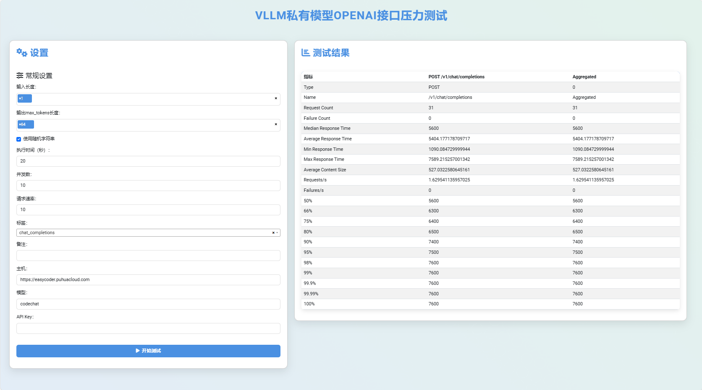

# FastAPI Task Runner

This project is a FastAPI application that allows users to run tasks using specified parameters. It leverages the Locust load testing tool to simulate user behavior and gather performance metrics.

## Features

- Define tasks with customizable parameters such as input/output lengths, user count, rate, and execution time.
- Supports random string input generation.
- Returns task results in JSON format.
- Static HTML interface for user interaction.

## Requirements

- Python 3.7+
- FastAPI
- Uvicorn
- Pydantic
- Loguru
- Pandas
- Locust

You can install the required packages using pip:

```bash
pip install fastapi uvicorn pydantic loguru pandas locust
```

## Project Structure

```
.
├── src
│   └── job.py          # Locust job definition
├── templates
│   └── index.html      # HTML interface
├── main.py             # FastAPI application
└── requirements.txt     # Python dependencies
```

## Configuration

You can configure the task parameters in the `TaskRequest` model. The following parameters are available:

- `input_lens`: Comma-separated string defining input lengths (default: "1,2").
- `output_lens`: Comma-separated string defining output lengths (default: "1,2").
- `user`: Number of simulated users (default: 10).
- `rate`: Rate of user spawn (default: 10).
- `time_`: Duration for which the test will run (default: "10s").
- `tags`: Tags for the task (default: `chat_completions`).
- `remark`: Optional remark for the task.
- `host`: Host URL for the Locust test (default: "https://api.openai.com").
- `RANDOM_STRING`: Boolean to indicate if random input strings should be used (default: False).

## Running the Application

To run the FastAPI application, execute the following command:

```bash
uvicorn main:app --host 0.0.0.0 --port 50000
```

You can then access the application at `http://localhost:50000`.

## API Endpoints

### Run Task

- **POST** `/run-task/`

  This endpoint accepts a JSON payload with the task parameters defined in the `TaskRequest` model. It triggers the task execution and returns the results.

  **Request Example:**

  ```json
    {
    "model": "codechat",
    "input_lens": "1,2",
    "output_lens": "1,2",
    "user": 10,
    "rate": 10,
    "time_": "10s",
    "tags": "chat_completions",
    "remark": "",
    "host": "https://api.openai.com",
    "RANDOM_STRING": false,
    "API_KEY": ""
    }
  ```

  **Response Example:**

  ```json
  {
    "status": "success",
    "result": {
      // Task results here
    }
  }
  ```

### Index Page

- **GET** `/`

  This endpoint serves a static HTML page for user interaction.

## Logging

The application uses Loguru for logging. Logs will be printed to the console, and you can modify the logging configuration as needed.

## Cleanup

After task execution, the generated CSV files will be deleted to keep the workspace clean.

## License

This project is licensed under the MIT License. See the LICENSE file for more details.

